# 💡 DataQuestPro

## 🏃‍♂️ 실행

-   [백엔드 배포 링크](http://15.164.56.233:80)
-   [프론트엔드 배포 링크](http://15.164.56.233:8000)
-   테스트용 계정 🧪

    ```py
    # 이메일 전송 기능 이용을 위해서는 실제 이메일로 회원가입을 진행하시는 것을 추천합니다.
    이메일: test@dqp.com
    비밀번호: test1
    ```

## 📝 프로젝트 목적 및 주요 기능

-   DataQuestPro는 유저 간 설문조사 생성 및 참여 플랫폼 서비스입니다.
-   주요기능:
    -   유저 회원가입, 로그인, 프로필 관리
    -   설문조사 생성/관리 및 참여/결과확인/관리
    -   이메일 인증 및 알림

## 👥 참여 인원

-   👨‍💻 권순세 - 유저 기능 개발, 유저 API 명세, 배포
-   👨‍💻 김현중 - 유저 기능 개발, 프론트엔드 개발
-   👨‍💻 송주헌 - 팀장, 알림 기능 개발, 브랜치 전략 수립
-   👨‍💻 양진우 - 유저 기능 개발, 프론트엔드 개발
-   👨‍💻 최익준 - 설문조사 기능 백엔드/프론트엔드 개발, 설문조사 API 명세, ERD 작성

## ⏳ 프로젝트 진행 기간

-   2023년 8월 17일부터 9월 1일까지 (약 2주간)

## 💻 기술 및 개발환경

-   **Front-end:**
    
    
    

-   **Back-end:**
    
    

-   **배포:**
    
    
    

-   **테스트:**
    

-   **개발 환경**

    -   Python: 3.10.11
    -   PostgreSQL: 15.4
    -   주요 라이브러리 및 버전

        ```js
        Django==4.2.4
        django-cors-headers==4.2.0
        django-filter==23.2
        djangorestframework==3.14.0
        djangorestframework-simplejwt==5.2.2
        drf-yasg==1.21.7
        psycopg2-binary==2.9.7
        PyYAML==6.0.1
        uWSGI==2.0.22
        ```

## 📊 ERD

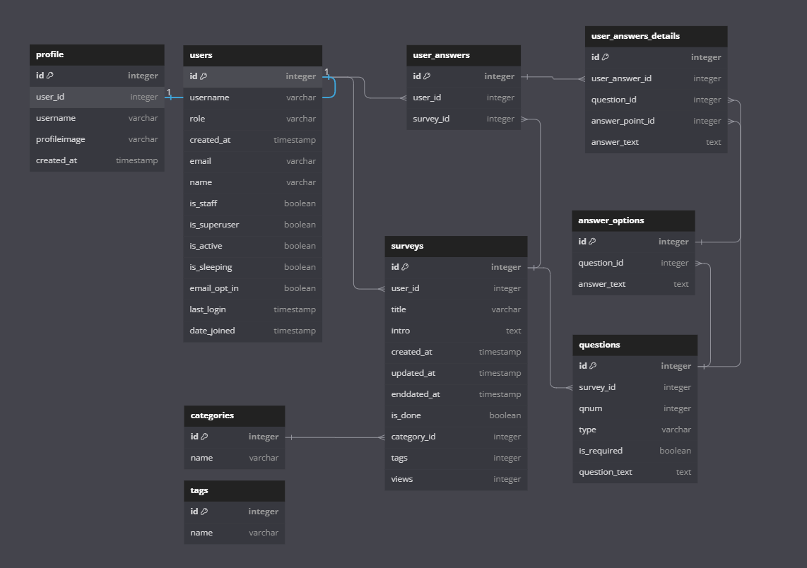

## 아키텍쳐

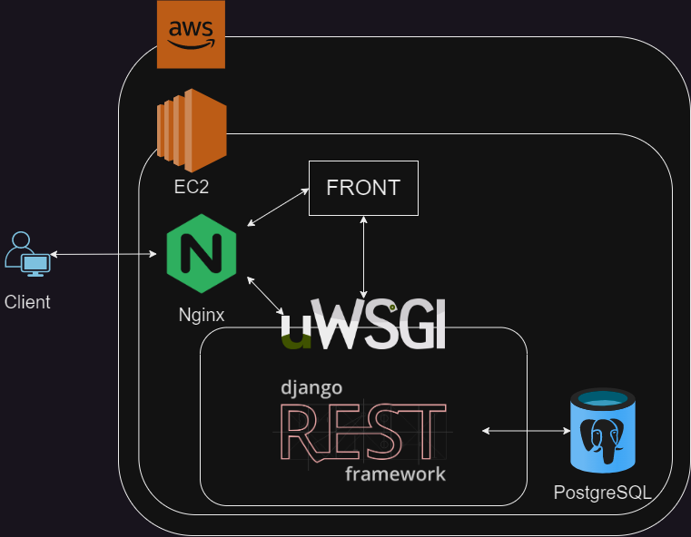

## 📄 API 명세서

Swagger 캡쳐 📸

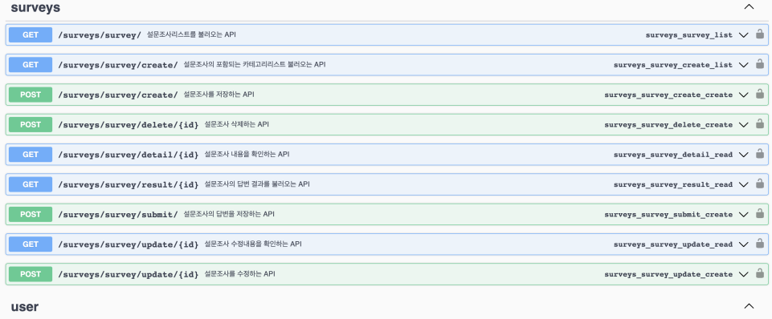
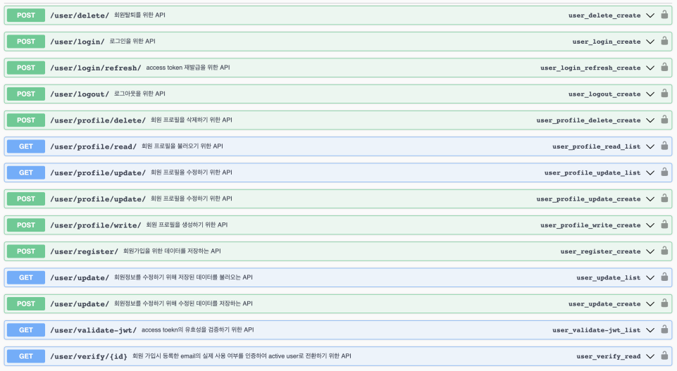

## 🎥 구현 (GIFs)

### 🔑 로그인

-   초기화면

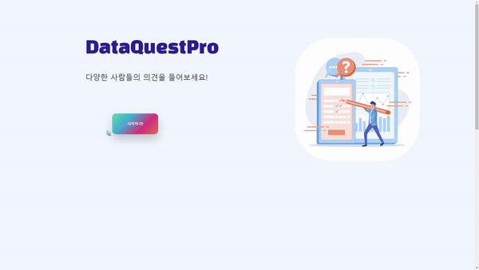

-   회원가입

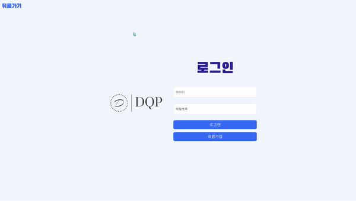

-   로그인 시도, 실패


-   인증 이메일 확인


-   로그인


-   로그아웃


### 📝 설문조사

-   카테고리별 설문조사 조회

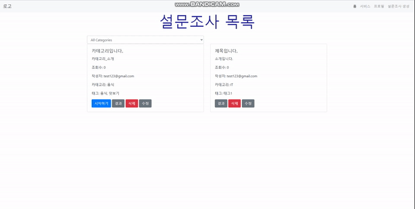

-   설문조사 생성

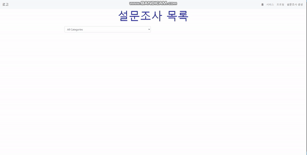

-   생성한 설문조사 수정


-   설문조사 참여

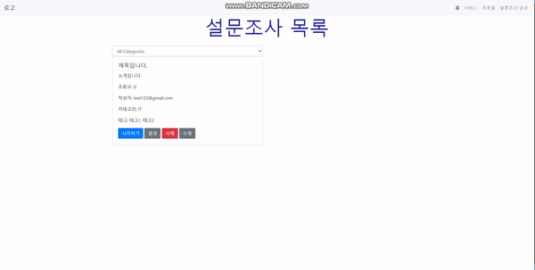

-   설문조사 결과 확인


-   제출한 설문조사 답변 수정


-   참여한 설문조사 재응답


-   생성한 설문조사 삭제


-   설문조사 생성 시 알림 메시지 이메일 전송


-   설문조사 완료 시 결과 확인 메시지 이메일 전송

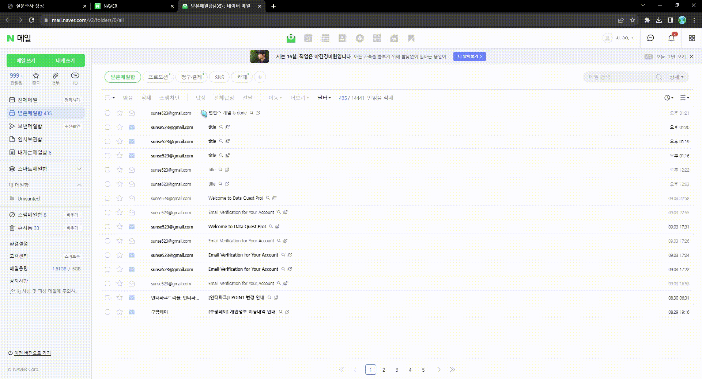

### 👤 프로필

-   프로필 보기

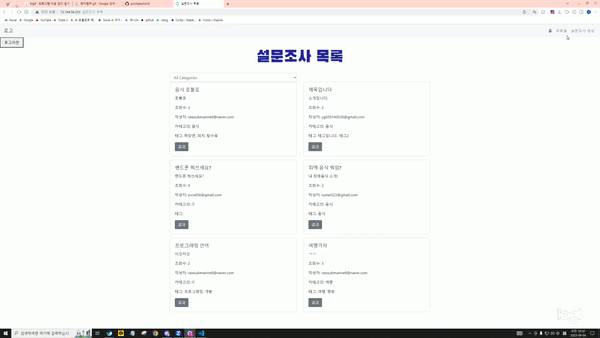

-   프로필 수정

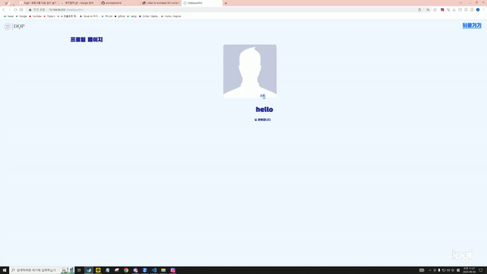

## 🛠️ 발생한 이슈 및 해결 방안 (트러블슈팅)

### 🚧 Issue #1

-   데이터모델링이 자꾸 바뀌는 문제

> ERD 작성 등의 데이터베이스 설계를 모두 마쳤다고 생각한 채로 개발 작업에 들어갔으나, 도중에 모델 변경이 불가피한 상황이 종종 발생함.

-   해결 방안

> 팀 회의를 통해 주요 기능의 작동 방식을 문장으로 자세하게 기술하고, 이를 바탕으로 ERD를 다시 작성하면서 데이터모델링을 고도화시켜 나갔음.

### 🚧 Issue #2

-   코드 설계 효율성 문제

> 사용자가 참여한 설문이 종료됐을 때, 그 결과를 확인할 수 있도록 이메일 전송 기능을 구현하려고 했으나 설문 기능의 View에 기능을 전부 넣기에는 로그인 이메일 기능 등과 겹치는 점이 많아 효율적이지 못한 문제가 발생함.

-   해결 방안

> 알림 이메일 전송 기능을 유저, 설문조사 View에 억지로 넣지 말고, 알림 기능을 분리하고 Django Signal을 활용하여 DB 저장 시 원하는 기능이 작동될 수 있도록 구현함.

### 🚧 Issue #3

-   배포 관련 문제

> 첫 배포 시도 당시 Gunicorn을 사용했는데, 환경설정이 원하는 대로 되지 않았고 시간 부족으로 인해 사용 경험이 있던 Uwsgi로 진행하였음  
> 그러나 BE/FE를 하나의 서버에 올리는 과정이 생소해 이 부분에서 어려움을 겪었음

-   해결 방안

> Nginx 환경설정 파일에서 server를 분리하여, BE는 80번 포트를, FE는 8000번 포트를 열어주는 방식으로 구현하는 데에 성공하였음

### 🚧 Issue #4

-   로그아웃 시 토큰 관련 문제

> 로그아웃 기능을 refresh token을 blacklist에 추가하는 방식으로 구현하였으나, 다른 기능에서 JWT Validate를 사용하면서 해당 refresh token과 함께 발급된 access token이 계속 인증되는 문제가 발생  
> 따라서 로그아웃 시에 refresh token과 함께 access token도 blacklist에 넣어서 문제를 해결하려고 시도했지만, 작동하지 않았음

-   해결 방안

> 공식 문서를 다시 확인한 결과 access token의 경우 refresh token과는 다르게 blacklist라는 method를 지원하지 않았음  
> BE에서 refresh token의 blacklist 추가 성공 response를 보내줬을 때, FE에서 local storage에 저장된 access/refresh token을 제거하는 방식으로 문제를 해결함

## 🙌 후기

-   권순세

    > 처음 다른 사람들과 GitHub 로 협업을 해 볼 수 있었습니다. Branch 전략, GitHub Project 등을 사용하는 것이 처음이었고, 다른 사람이 쓴 코드와 병합할 때 conflict을 해결하는 과정이 매우 어려웠습니다.  
    > 하지만 혼자 개발할 때와 달리 개발하며 다른 사람과 의견을 주고 받으며 , 문제를 해결하고, 기능을 완성하는 과정이 참 재미있었던 경험이었습니다.

-   김현중

    > 첫 협업 프로젝트에 부족한 부분이 많아 자신 없게 시작했지만 팀원들의 열정적인 모습에 힘을 얻었습니다. 기획단계의 비중이 높았고, 원하는 기능을 모두 구현하기까지 시간이 조금 더 필요하다고 생각되는 만큼 개발 실력이 상승됨에 따라 이 프로젝트의 잠재성이 더 드러날 것이라고 보고, 더 공부하고 싶은 동기부여를 주는 프로젝트였습니다.

-   송주헌

    > 다행히 전에 GitHub Organization을 이용한 협업 프로젝트에 참여해본 적이 있어서, 기능별로 Branch를 분리하고 Pull Request를 통해 Merge Conflict를 해결하는 부분에 있어서 미약하게나마 팀에 도움이 될 수 있었습니다.  
    > 그러나 잘못 알고있었거나 얕은 수준에 머물렀던 지식이 꽤 존재했고, 이를 팀원들과 함께 바로잡아가며 다같이 성장했던 것 같습니다.

-   양진우

    > 첫 프로젝트를 진행하면서 개인으로 할 때보다 훨씬 많은 것을 신경 써야 했고 상상했던 것 이상으로 회의를 많이 진행해야 했기 때문에 체력적으로 많이 지쳤던 것도 있었지만 항상 열정적이고 탐구적인 팀원분들의 모습에 힘을 많이 얻었습니다. 부족한 모습이었지만 같이 끌어가 주시려는 팀원분들에게 감사하며 훨씬 더 많은 공부가 필요하다는 것을 느꼈습니다.  
    > Github 사용법이 능숙하지 않아 프로젝트를 처음부터 진행하는 데 어려움을 느꼈으며, 프론트엔드 부분에서 잘 알고 있다고 생각한 것 들도 막상 구현해보면 확실하지 않아 많은 시간이 걸렸습니다.

-   최익준

    > 처음에 주제를 정하는 회의를 할 때부터 개인으로 할 때보다 더 많은 프로젝트 주제가 나와서 더 많은 생각을 하게 되었습니다.  
    > GitHub로 협업을 진행하면서 분업했던 방식과 브랜치를 나눠서 개발을 했던 과정이 개인으로는 할 수 없었던 좋은 경험이었습니다.  
    > 프론트엔드에서는 JS으로 동적으로 질문과 답변을 추가하는 이벤트 핸들링 부분에서 JS Error가 자주 발생해서 만들기 어려웠습니다.

## 👨‍🎓 추가 및 리서치 하고 싶은 기능

-   설문을 생성할 때, ChatGPT를 활용하여 사용자가 원하는 주제와 목적에 맞는 질문을 추천해주는 기능을 추가할 생각이 있다.

-   설문조사 서비스인만큼, 통계 관련한 지표(평균, 중위수, 최솟값, 최댓값)도 함께 구현하여 시각화 기능을 고도화 하고싶다.

-   설문조사 결과 페이지에서 유저끼리 의견을 주고 받을 수 있는 댓글 기능을 추가하면 더 좋을 것 같다.

-   로그인하지 않은 유저도 링크를 통해 참여할 수 있도록 해 범용성을 늘린다면 좋을 것 같다.

## 📚 참고자료

> Django Signals: https://docs.djangoproject.com/en/4.2/topics/signals/  
> Django SMTP, sending email: https://docs.djangoproject.com/en/4.2/topics/email/  
> DRF-simpleJWT: https://django-rest-framework-simplejwt.readthedocs.io/en/latest/  
> DRF-yasg: https://drf-yasg.readthedocs.io/en/stable/
